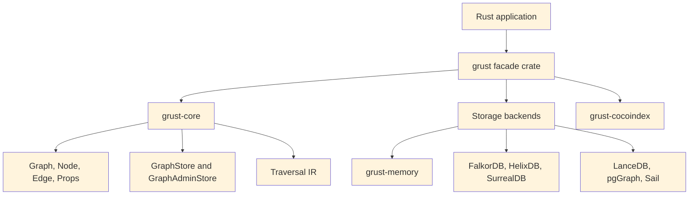
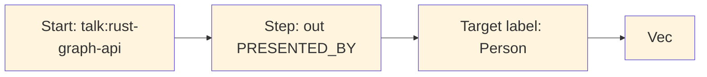
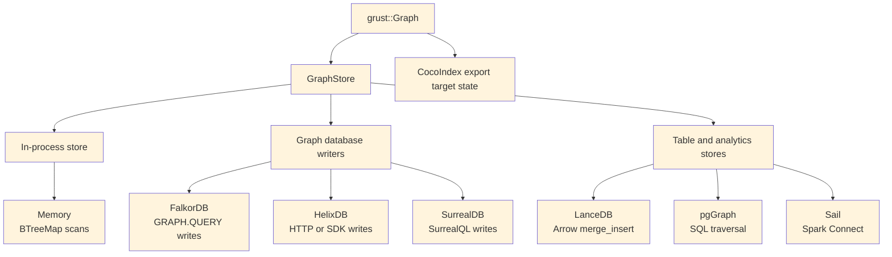
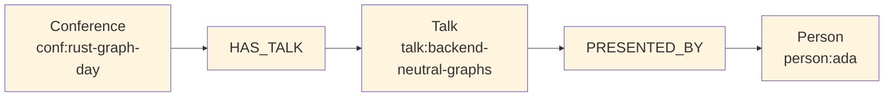
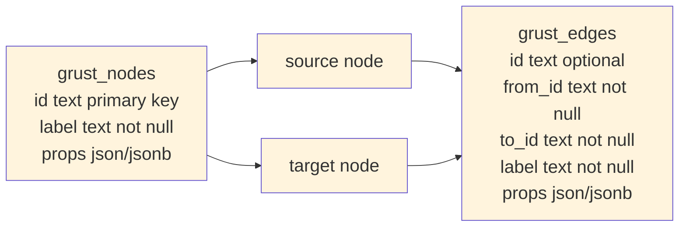

# Preface

Grust is a small Rust property graph API with a large architectural promise:
application code should be able to build, validate, traverse, and persist graph
data without committing itself to a database query language too early.

That goal matters because many graph-shaped Rust applications live between
worlds. A crawler wants a local graph while it extracts facts. An indexing
pipeline wants deterministic target state. A data product may begin with tests
and an in-memory backend, then later need SurrealDB, FalkorDB, PostgreSQL,
LanceDB, Sail, or another backend. Grust gives those applications one model to
program against:

```text
Graph = nodes + edges
Node  = id + label + properties
Edge  = optional id + from + to + label + properties
```

This book is a guided tour of that model. It covers the workspace architecture,
the Rust concepts the code leans on, the core graph types, traversal IR, backend
contracts, implemented backends, proposed backends, and practical examples.

# 1. The Shape of Grust

Grust is not trying to be every graph library for Rust. It is not an algorithm
crate like `petgraph`, and it is not a thin wrapper around a single database. It
is a property graph layer: a compact model of labeled nodes, labeled edges, and
typed properties that can be carried across storage engines.

The current workspace is arranged around one core crate, one public facade, and
backend or integration crates:



The `grust-core` crate owns the durable concepts. It defines identifiers,
labels, property values, graph builders, schemas, traversals, error types, load
reports, and backend traits. The `grust` crate re-exports those pieces and gates
backend crates behind Cargo features.

That split is important. Core model code stays light, deterministic, and mostly
dependency-free. Backends are allowed to depend on Redis, SurrealDB, LanceDB,
PostgreSQL, Spark Connect, HTTP clients, gRPC clients, or SDKs without dragging
those dependencies into every Grust user.

# 2. The Core Property Graph

At the center of Grust are three public data structures:

```rust
pub struct Graph {
    pub nodes: Vec<Node>,
    pub edges: Vec<Edge>,
}

pub struct Node {
    pub id: NodeId,
    pub label: Label,
    pub props: Props,
}

pub struct Edge {
    pub id: Option<EdgeId>,
    pub from: NodeId,
    pub to: NodeId,
    pub label: Label,
    pub props: Props,
}
```

`NodeId`, `EdgeId`, and `Label` are newtypes over `String`. They are small
wrappers, but they carry meaning through Rust's type system. A function that
expects a `Label` cannot accidentally receive an `EdgeId` without an explicit
conversion. The wrappers implement common conversion traits such as `From<&str>`
and `From<String>`, so the public API remains ergonomic.

Properties are stored in a `BTreeMap<String, Value>`:

```rust
pub enum Value {
    Null,
    Bool(bool),
    Int(i64),
    Float(f64),
    String(String),
    StringArray(Vec<String>),
    Json(serde_json::Value),
}
```

The use of `BTreeMap` is a quiet but useful choice. Iteration order is stable,
which makes generated JSON, tests, and backend query generation more
predictable. That is especially helpful in a project whose backends turn one
graph into SQL, Cypher-like queries, Arrow batches, JSON target state, or SDK
calls.

`Node::new` also inserts an `id` property if one is not already present. That
means a Grust node has a first-class typed identity and an ordinary property
view of that identity, which helps backends that identify records through
property maps.

# 3. Building Graphs

Most application code should not construct every `Node` and `Edge` by hand. It
should use `GraphBuilder`:

```rust
use grust::prelude::*;

let mut builder = GraphBuilder::new();

let talk = builder
    .node("Talk", "talk:rust-graph-api")
    .prop("title", "A Modern Graph API for Rust")
    .prop("year", 2026_i64)
    .finish();

let speaker = builder
    .node("Person", "person:ada")
    .prop("name", "Ada Example")
    .finish();

builder
    .edge("PRESENTED_BY", &talk, &speaker)
    .prop("source", "conference-schedule")
    .finish();

let graph = builder.build();
```

The builder deduplicates nodes by `NodeId`. If an existing node has the same
label, additional properties are merged into it. Edges default to
`EdgePolicy::DedupeByFromLabelTo`, so the tuple `(from, label, to)` is treated
as the relationship identity. Domains that need true multi-edges can opt into
`EdgePolicy::AllowDuplicates`.

```rust
let mut builder = GraphBuilder::new()
    .edge_policy(EdgePolicy::AllowDuplicates);
```

This is an example of Grust's overall style: put the common property-graph case
on the simple path, but leave an explicit escape hatch for graph models with
different identity rules.

## Loading and Saving Graph Documents

A `Graph` can also move through textual document formats without touching a
backend. The core crate exposes paired constructors and serializers for YAML,
JSON, and XML:

```rust
let graph = Graph::from_yaml(yaml_text)?;
let yaml_text = graph.to_yaml()?;

let graph = Graph::from_json(json_text)?;
let json_text = graph.to_json()?;

let graph = Graph::from_xml(xml_text)?;
let xml_text = graph.to_xml()?;
```

These methods are useful for fixtures, migration inputs, examples, audits, and
small graph interchange files. They all feed the same validation path, so a
document with duplicate node ids or an edge that points at a missing node fails
before it reaches a store.

YAML and JSON share the same document shape. A property value can be written as
a plain JSON-like scalar when the type is obvious, or as the tagged Grust
`Value` representation when the exact variant matters:

```json
{
  "nodes": [
    {
      "id": "talk:rust-graph-api",
      "label": "Talk",
      "props": {
        "title": "A Modern Graph API for Rust",
        "year": 2026,
        "tracks": {
          "type": "string_array",
          "value": ["rust", "graphs"]
        }
      }
    },
    {
      "id": "person:ada",
      "label": "Person",
      "props": {
        "name": "Ada Example"
      }
    }
  ],
  "edges": [
    {
      "label": "PRESENTED_BY",
      "from": "talk:rust-graph-api",
      "to": "person:ada",
      "props": {
        "source": "conference-schedule"
      }
    }
  ]
}
```

The XML form is more explicit because XML has no native object or array type.
Properties are represented as repeated `prop` entries with a `key` and a tagged
`value`:

```xml
<graph>
  <nodes>
    <node>
      <id>talk:rust-graph-api</id>
      <label>Talk</label>
      <props>
        <prop>
          <key>title</key>
          <value>
            <type>string</type>
            <value>A Modern Graph API for Rust</value>
          </value>
        </prop>
      </props>
    </node>
    <node>
      <id>person:ada</id>
      <label>Person</label>
    </node>
  </nodes>
  <edges>
    <edge>
      <label>PRESENTED_BY</label>
      <from>talk:rust-graph-api</from>
      <to>person:ada</to>
    </edge>
  </edges>
</graph>
```

Serialization removes the generated `id` property from node property maps when
it only mirrors the node's `NodeId`. That keeps exported documents readable
without changing what `Node::new` guarantees after loading.

# 4. Traversal as an Intermediate Representation

Grust traversal is not Cypher, SQL, GQL, SurrealQL, Spark SQL, or a graph
database dialect. It is a small Rust intermediate representation:

```rust
let traversal = Traversal::from_node("talk:rust-graph-api")
    .out("PRESENTED_BY")
    .to("Person")
    .limit(10);
```

A traversal has a start expression, a sequence of steps, and an optional limit.
The start can be a single node, all nodes with a label, or nodes with a property
value. Each step has a direction, an optional edge label, and an optional target
node label.



The IR is deliberately modest. That makes it implementable across a wide range
of backends. The memory backend can scan maps. LanceDB can query tables by hop.
pgGraph can lower to SQL over universal graph tables. Sail can lower to Spark
SQL through Spark Connect. Backends that do not yet support reads can return
`GrustError::Unsupported`.

This design also protects application code. A caller asks for a graph-shaped
operation; the backend decides whether that operation becomes a map scan, a SQL
join, a DataFrame query, a Redis graph command, or a future native graph query.

# 5. The Store Contract

The central backend trait is `GraphStore`:

```rust
#[async_trait::async_trait]
pub trait GraphStore: Send + Sync {
    async fn apply_schema(&self, schema: &GraphSchema) -> Result<()>;
    async fn put_node(&self, node: &Node) -> Result<NodeId>;
    async fn put_edge(&self, edge: &Edge) -> Result<Option<EdgeId>>;
    async fn put_graph(&self, graph: &Graph) -> Result<LoadReport>;
    async fn get_node(&self, id: &NodeId) -> Result<Option<Node>>;
    async fn get_edges(&self, query: EdgeQuery) -> Result<Vec<Edge>>;
    async fn traverse(&self, traversal: Traversal) -> Result<Vec<Node>>;
}
```

The trait is async because real graph stores usually cross a process, network,
database, or object-store boundary. The `async_trait` crate hides the current
limitations around async functions in object-safe traits and lets backend
implementations present one uniform interface.

`put_graph` takes `&Graph` instead of consuming `Graph`. That keeps retry,
audit, comparison, and multi-backend loading workflows straightforward:

```rust
let report = store.put_graph(&graph).await?;
backup_store.put_graph(&graph).await?;
println!("loaded {} nodes and {} edges", report.nodes, report.edges);
```

Administrative operations are split into `GraphAdminStore`:

```rust
#[async_trait::async_trait]
pub trait GraphAdminStore: GraphStore {
    async fn bootstrap(&self) -> Result<()> { Ok(()) }
    async fn clear(&self) -> Result<()>;
}
```

This separation keeps ordinary application persistence apart from setup and
destructive workflows. A production service may receive a `GraphStore`, while a
test harness or migration tool can require `GraphAdminStore`.

# 6. Rust Concepts Used

Grust is a good example of idiomatic Rust applied to a storage abstraction.

Newtypes give semantic weight to strings. `NodeId`, `EdgeId`, and `Label` are
cheap wrappers, but they prevent accidental parameter swaps and produce clearer
APIs.

Trait-based polymorphism defines the backend boundary. Application code can be
generic over `impl GraphStore`, while each backend owns its own connection,
configuration, batching, serialization, and query strategy.

Feature flags keep the facade crate light. The public `grust` crate re-exports
backend crates only when features such as `memory`, `lancedb`, `pggraph`,
`sail`, `falkor`, `helix`, `surreal`, or `cocoindex` are enabled.

Serde makes the graph model portable. Core types derive `Serialize` and
`Deserialize`, and backends can turn properties into JSON strings, JSONB,
Arrow string columns, or target-state maps.

Interior mutability appears where it is appropriate. The memory backend stores
its graph behind `Arc<RwLock<...>>`, making cloned stores share state while
keeping mutation synchronized.

Error typing is explicit. `GrustError` distinguishes backend, schema,
unsupported-feature, and serialization failures. That lets a caller tell the
difference between "the database rejected this" and "this backend does not yet
support traversal."

# 7. Backend Architecture

Backends share the same input model but not the same execution model:



Some backends are full read/write/traversal stores today. Others currently
focus on writes and administrative loading. That is normal for an early
multi-backend project, and the trait makes the maturity boundary explicit.

## Memory

`grust-memory` is the deterministic local backend. It stores nodes in a
`BTreeMap<NodeId, Node>` and edges in a `BTreeMap<(NodeId, Label, NodeId), Edge>`.
Reads and traversals scan those maps. It is the best backend for tests, examples,
and local workflows that need no external service.

```rust
use grust::prelude::*;

# async fn demo(graph: Graph) -> grust::Result<()> {
let store = MemoryGraphStore::new();
store.put_graph(&graph).await?;

let people = store
    .traverse(
        Traversal::from_node("talk:rust-graph-api")
            .out("PRESENTED_BY")
            .to("Person"),
    )
    .await?;
# Ok(())
# }
```

## LanceDB

`grust-lancedb` treats LanceDB first as a durable Arrow-native table store. It
uses two tables, one for nodes and one for edges. Nodes are keyed by `id`. Edges
are keyed by an explicit edge id when present, or by a deterministic
`from + label + to` key otherwise. Writes use LanceDB `merge_insert`, and
traversal performs hop-by-hop table queries.

This backend is a natural home for later vector-search extensions. The core
`GraphStore` trait should stay graph-focused; LanceDB-specific nearest-neighbor
search can live in an extension trait without leaking into every backend.

## pgGraph

`grust-pggraph` stores the source of truth in ordinary PostgreSQL tables:

```sql
grust_nodes(id text primary key, label text not null, props jsonb not null)
grust_edges(id text, from_id text not null, to_id text not null,
            label text not null, props jsonb not null)
```

The backend can bootstrap the `graph` extension, create tables and indexes,
register graph tables, and optionally build the pgGraph projection. Reads use
SQL against the universal tables. Traversal is lowered to SQL joins over those
tables, with pgGraph projection support available as the backend matures.

## Sail

`grust-sail` connects to a Sail Spark Connect server over gRPC. It stores graph
data in Spark DataFrames backed by Delta tables. Commands such as table creation
and `MERGE INTO` are sent as Spark Connect command plans; reads are sent as SQL
relation plans and decoded from Arrow IPC streams.

The implementation has an important practical detail: edge rows carry source
and destination labels as well as IDs. That allows traversal joins to match node
labels without an extra lookup during each edge hop.

## FalkorDB, HelixDB, and SurrealDB

The FalkorDB backend writes through Redis `GRAPH.QUERY` using Cypher-like
`MERGE` statements. It batches nodes by label path and edges by relationship
type.

The HelixDB backend has HTTP and SDK stores. Both support batched writes; reads
and traversal currently report unsupported operations.

The SurrealDB backend also has HTTP and SDK stores. It can bootstrap, clear,
upsert nodes, and relate edges. Like Helix today, read and traversal support is
not yet implemented.

## CocoIndex

`grust-cocoindex` is intentionally not an ordinary `GraphStore`. CocoIndex is an
incremental target-state system, so the Grust integration exports a graph as
serializable node and relationship state:

```rust
let export = graph.to_cocoindex_export()?;
```

The export uses Grust node IDs as target keys, converts properties to JSON, and
requires edge endpoints to exist in the graph so relationship source and target
labels can be emitted.

# 8. Example: A Conference Graph

Here is a complete graph-building example:

```rust
use grust::prelude::*;

fn conference_graph() -> Graph {
    let mut g = Graph::builder();

    let rust = g
        .node("Conference", "conf:rust-graph-day")
        .prop("name", "Rust Graph Day")
        .prop("city", "San Francisco")
        .finish();

    let talk = g
        .node("Talk", "talk:backend-neutral-graphs")
        .prop("title", "Backend-Neutral Graphs in Rust")
        .prop("track", "systems")
        .finish();

    let ada = g
        .node("Person", "person:ada")
        .prop("name", "Ada Example")
        .prop("role", "speaker")
        .finish();

    g.edge("HAS_TALK", &rust, &talk).finish();
    g.edge("PRESENTED_BY", &talk, &ada)
        .prop("confirmed", true)
        .finish();

    g.build()
}
```

The resulting graph can be loaded into memory, exported to CocoIndex target
state, or sent to a configured backend:

```rust
# use grust::prelude::*;
# async fn load<S: GraphStore>(store: &S, graph: Graph) -> grust::Result<()> {
let report = store.put_graph(&graph).await?;
assert_eq!(report.nodes, 3);
assert_eq!(report.edges, 2);
# Ok(())
# }
```

Traversing from a conference to speakers becomes a backend-neutral expression:

```rust
let speakers = store
    .traverse(
        Traversal::from_node("conf:rust-graph-day")
            .out("HAS_TALK")
            .to("Talk")
            .out("PRESENTED_BY")
            .to("Person"),
    )
    .await?;
```



# 9. Schema and Validation Direction

Grust already has schema types: `GraphSchema`, `NodeType`, `EdgeType`, `Field`,
`FieldType`, and `EdgeUniqueness`. The default `GraphStore::apply_schema`
implementation is a no-op, which lets schemaless or schema-later backends work
without ceremony.

Schema becomes more important for backends that want typed tables, indexes, or
label-partitioned layouts. A future schema-first backend could use
`GraphSchema` to create one table per node label, one table per edge label,
typed property columns, and targeted indexes. A more flexible backend can keep
using universal node and edge tables.

The key architectural point is that schema is metadata about a Grust graph, not
a replacement for the graph. Application code can begin with plain graph
construction, add schemas when operational needs demand it, and still speak the
same store trait.

# 10. Design Tradeoffs

The universal node/edge layout appears in multiple backend plans because it is
the easiest way to preserve arbitrary property graphs:



The cost is that property typing and label-specific optimization require extra
work. A label-partitioned backend can use stronger types and better indexes, but
it needs schema, migrations, and more planning.

Grust's current architecture keeps both paths open. Core stays universal.
Backends choose their storage layout. Schema support can become richer without
forcing every backend to look the same.

# 11. Where Grust Can Grow

The next natural step is to deepen read and traversal support across the write
focused backends. FalkorDB, HelixDB, and SurrealDB already have enough write
surface to load graphs; adding reads would make them more symmetric with memory,
LanceDB, pgGraph, and Sail.

Traversal can also grow carefully. Property filters, bounded depth, path
returns, shortest paths, and aggregation are all tempting. The important rule is
to extend the IR only when several backends can implement the concept without
smuggling database-specific query strings through the abstraction.

Incremental mutation is another likely addition. A dedicated mutation trait
could express upsert and delete operations directly:

```rust
pub enum GraphMutation {
    UpsertNode(Node),
    DeleteNode(NodeId),
    UpsertEdge(Edge),
    DeleteEdge {
        id: Option<EdgeId>,
        from: NodeId,
        label: Label,
        to: NodeId,
    },
}
```

That would serve CocoIndex-style target-state systems, streaming pipelines, and
ordinary applications that need to apply deltas instead of replacing whole
graphs.

# Conclusion

Grust is small by design. Its core model is easy to hold in your head, and its
backend contract is narrow enough that very different systems can implement it.
That is the source of its leverage.

The project says: build your graph once, keep the domain model in Rust, and let
the backend translate. Sometimes that translation is a map scan. Sometimes it is
Arrow and LanceDB. Sometimes it is PostgreSQL, Spark SQL, Redis graph commands,
SurrealQL, Helix SDK calls, or CocoIndex target state.

The more Grust grows, the more important that center becomes: a stable property
graph model, a backend-neutral traversal IR, explicit errors, feature-gated
integrations, and enough Rust type structure to make the right path feel natural.
