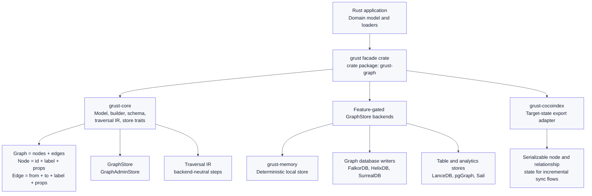
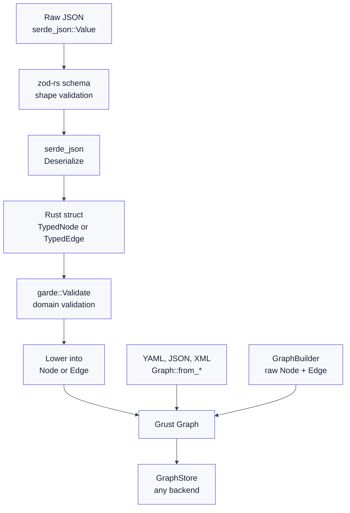
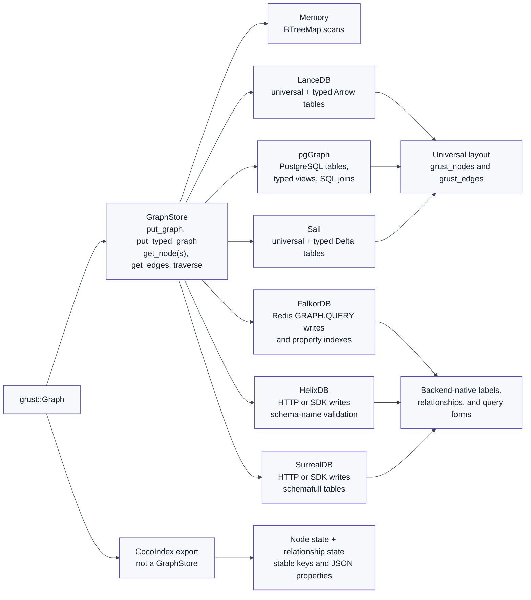
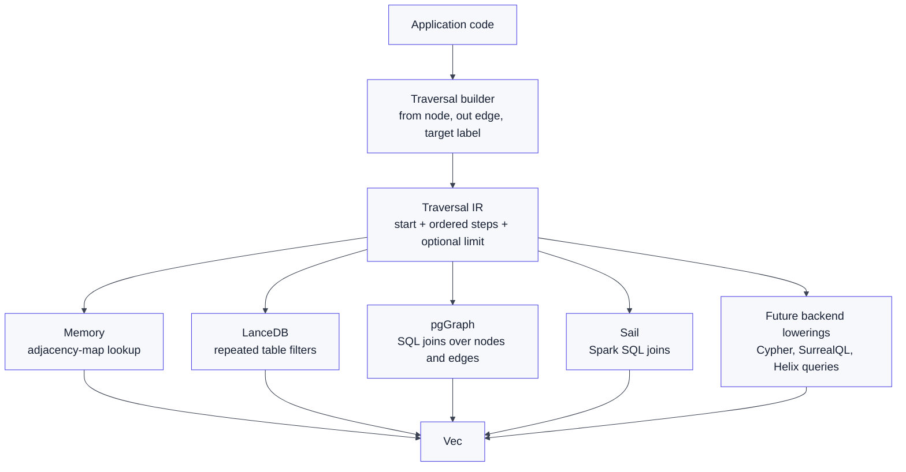

# Grust: Backend-Neutral Property Graphs for Rust

Rust has good graph libraries when the graph is mainly an in-memory data
structure. It has database clients when the graph already belongs to one storage
engine. Grust sits in the space between those two worlds.

Grust is a compact property graph API for Rust: labeled nodes, labeled edges,
typed properties, stable IDs, a graph builder, document loaders, optional typed
ingestion, a traversal IR, and an async store contract. The goal is not to turn
every backend into the same database. The goal is to let Rust application code
build one graph-shaped domain model, then let backend crates decide how that
model should be stored, queried, exported, or synchronized.

The project is here:

- Repository: [github.com/querygraph/grust](https://github.com/querygraph/grust)
- Public facade crate: [grust-graph](https://crates.io/crates/grust-graph)
- Core crate: [grust-core](https://crates.io/crates/grust-core)
- Backend and integration crates: [grust-memory](https://crates.io/crates/grust-memory), [grust-lancedb](https://crates.io/crates/grust-lancedb), [grust-pggraph](https://crates.io/crates/grust-pggraph), [grust-sail](https://crates.io/crates/grust-sail), [grust-falkor](https://crates.io/crates/grust-falkor), [grust-helix](https://crates.io/crates/grust-helix), [grust-surreal](https://crates.io/crates/grust-surreal), and [grust-cocoindex](https://crates.io/crates/grust-cocoindex)

The current `0.7.0` line is the first version where I think the whole shape is
visible and release-tested against live backends: the core graph model,
document loading, typed ingestion, schema-backed store writes, traversal
lowering, backend-specific typed storage hooks, and explicit Sail, SurrealDB,
FalkorDB, HelixDB, LanceDB, CocoIndex, and pgGraph integration checks are all
present in the same workspace. Some backend features are still young, but the
contract is no longer just a sketch.

For the longer treatment, read the Grust book in the repository, especially
**The Shape of Grust**, **The Core Property Graph**, **Building Graphs**,
**Loading and Saving Graph Documents**, **Typed Graph Ingestion with garde and
zod-rs**, **Traversal as an Intermediate Representation**, **The Store
Contract**, **Backend Architecture**, **Schema and Validation Direction**,
**Design Tradeoffs**, and **Where Grust Can Grow**. I am referencing headings
rather than page numbers because the book is alive and will keep moving as the
library does.



## The Shape of the API

The core model is intentionally small:

```text
Graph = nodes + edges
Node  = id + label + properties
Edge  = optional id + from + to + label + properties
```

That shape maps naturally to graph databases, table-backed graph projections,
export pipelines, and local test stores. It is also small enough that
application code can build graphs without committing early to Cypher,
SurrealQL, Spark SQL, pgGraph, LanceDB filters, or a particular SDK.

The facade crate is published as `grust-graph`, but its library name is
`grust`, so application code imports it as:

```rust
use grust::prelude::*;
```

Under that facade, `grust-core` owns the durable model: `Graph`, `Node`, `Edge`,
`NodeId`, `EdgeId`, `Label`, `Value`, `GraphBuilder`, schema types, traversal
types, error types, load reports, and backend traits. Backend crates are
feature-gated so a user who only needs the in-memory store does not inherit the
dependencies for Redis, PostgreSQL, LanceDB, SurrealDB, Spark Connect, or
HelixDB.

The book chapter **The Shape of Grust** is the best place to start if you want
the architectural tour. **The Core Property Graph** then walks through the
public data types and the small but important choices, such as typed ID wrappers
and deterministic `BTreeMap` property storage.

## Building a Graph Once

Most code should use `GraphBuilder` rather than manually assembling every node
and edge:

```rust
use grust::prelude::*;

let mut graph = GraphBuilder::new();

let talk = graph
    .node("Talk", "talk:rust-graph-api")
    .prop("title", "A Modern Graph API for Rust")
    .prop("abstract", "Building backend-neutral property graphs in Rust.")
    .finish();

let speaker = graph
    .node("Person", "person:ada")
    .prop("name", "Ada Example")
    .prop("organization", "Graph Systems Lab")
    .finish();

graph
    .edge("PRESENTED_BY", &talk, &speaker)
    .prop("source", "conference-schedule")
    .finish();

let graph = graph.build();
```

The builder gives the library a natural place to enforce Grust-level
consistency. It deduplicates nodes by `NodeId`, and by default it deduplicates
edges by `(from, label, to)`. Domains that need multi-edges can opt into
`EdgePolicy::AllowDuplicates`.

The chapter **Building Graphs** is worth reading after the quick start. It
explains why construction belongs at the application boundary and why
`GraphBuilder` is more than a convenience wrapper.

## Graph Documents and Typed Ingestion

Grust now has two complementary ways to ingest graph data before it reaches a
backend.

The first is document loading. `Graph::from_yaml`, `Graph::from_json`, and
`Graph::from_xml` load ordinary graph documents and validate graph-level
consistency, such as duplicate node IDs and edges pointing at missing nodes.
The paired `to_yaml`, `to_json`, and `to_xml` methods make fixtures and
interchange files easy to round trip.

The second is typed ingestion. The optional `typed-garde` feature lets users
define Rust structs for domain facts, validate them with `garde`, and lower
them into ordinary Grust nodes and edges:

```toml
[dependencies]
grust = { package = "grust-graph", version = "0.7.0", features = ["typed-garde"] }
```

```rust
use grust::prelude::*;
use grust::typed::garde;
use serde::Serialize;

#[derive(Debug, Serialize, garde::Validate)]
#[garde(allow_unvalidated)]
struct Person {
    #[garde(length(min = 1))]
    id: String,
    #[garde(length(min = 1))]
    name: String,
}

impl TypedNode for Person {
    const LABEL: &'static str = "Person";

    fn node_id(&self) -> NodeId {
        format!("person:{}", self.id).into()
    }
}
```

`TypedGraphBuilder` validates a `TypedNode` or `TypedEdge` before adding it to
the graph. It also coexists with untyped Grust values:

```rust
let mut builder = TypedGraphBuilder::from_graph(existing_graph);
builder.add_node(&person)?;
builder.add_raw_edge(Edge::new("AUTHORED", "person:nia", "doc:proposal", Props::new()));
let graph = builder.build();
```

That means a project can keep loading existing graph documents while gradually
adding typed constructors for labels and relationships where Rust validation is
valuable.

Typed readback goes through the same plain graph model. After a backend returns
a `Node` or `Edge`, `Person::from_node(&node)?` or `WorksOn::from_edge(&edge)?`
deserializes the stored props, runs garde validation, and checks that the typed
identity still matches the graph value.

For raw JSON boundaries, the optional `typed-zod-rs` feature adds another
stage. If you have not used Zod before: it is a popular TypeScript validation
style where a runtime schema checks untrusted data before application code
treats it as typed. In Grust, `zod-rs` plays that role for
`serde_json::Value`. The flow is:

```toml
[dependencies]
grust = { package = "grust-graph", version = "0.7.0", features = ["typed-zod-rs"] }
```

`typed-zod-rs` implies `typed-garde`, because the JSON boundary still lowers
into validated Rust values before those values become graph data.

```text
raw JSON -> zod-rs shape validation -> Serde decode -> garde validation -> Grust graph
```

The separation is useful. zod-rs can say "this field should be an array."
Serde can decode that array into a Rust `Vec<String>`. garde can say "this
vector must contain at least two skills" or "this allocation must be between 1
and 100." The resulting data is still just a normal `Graph`.

```rust
use grust::prelude::*;
use serde::{Deserialize, Serialize};
use serde_json::json;
use zod_rs::prelude::{Schema, object, string};

#[derive(Debug, Deserialize, Serialize, garde::Validate)]
#[garde(allow_unvalidated)]
struct Person {
    #[garde(length(min = 1))]
    id: String,
    #[garde(length(min = 1))]
    name: String,
    #[garde(length(min = 1), inner(length(min = 1)))]
    skills: Vec<String>,
}

let person_schema = object()
    .field("id", string().min(1))
    .field("name", string().min(1))
    .field("skills", string().min(1).array())
    .strict();

let person: Person = parse_typed_json(
    &person_schema,
    &json!({
        "id": "nia",
        "name": "Nia",
        "skills": ["rust", "graphs"]
    }),
)?;
```

The current book chapter **Typed Graph Ingestion with garde and zod-rs** gives
the full treatment: garde-only construction, typed and untyped coexistence, a
Zod overview, zod-rs plus garde examples, the error boundary between shape and
domain validation, and how typed ingestion relates to `GraphSchema`.



## The Store Contract

The central abstraction is `GraphStore`:

```rust
#[async_trait::async_trait]
pub trait GraphStore: Send + Sync {
    async fn apply_schema(&self, schema: &GraphSchema) -> Result<()>;
    async fn put_node(&self, node: &Node) -> Result<PutOutcome>;
    async fn put_edge(&self, edge: &Edge) -> Result<PutOutcome>;
    async fn put_graph(&self, graph: &Graph) -> Result<LoadReport>;
    async fn put_typed_graph(&self, schema: &GraphSchema, graph: &Graph) -> Result<LoadReport>;
    async fn get_node(&self, id: &NodeId) -> Result<Option<Node>>;
    async fn get_nodes(&self, ids: &[NodeId]) -> Result<Vec<Node>>;
    async fn get_edges(&self, query: EdgeQuery) -> Result<Vec<Edge>>;
    async fn traverse(&self, traversal: Traversal) -> Result<Vec<Node>>;
}
```

The trait is async because real graph stores often cross a process, network,
database, or object-store boundary. `put_graph` borrows `&Graph` rather than
consuming it, which makes retries, audit, comparison, and multi-backend loading
straightforward. `put_typed_graph` adds a schema-backed path: validate the graph
against `GraphSchema`, apply that schema to the backend, and then write the
graph through the same store contract.

Single-element writes return `PutOutcome`, so callers can tell the difference
between inserted, updated, backend-opaque upserted, and deduped writes when a
backend can expose that distinction.

Administrative operations live in `GraphAdminStore`, where `bootstrap` and
`clear` can support test harnesses, demos, migrations, and replacement
workflows without making every production caller responsible for destructive
capabilities.

The book chapter **The Store Contract** gives this trait the attention it
deserves. It is the piece that lets a memory store, a LanceDB table layout, a
pgGraph projection, a Sail DataFrame backend, and graph database writers all
present the same Rust-facing boundary.



## Backends Without Leaking Backend Languages

Grust has several backend and integration crates:

- `grust-memory` is the deterministic local store for tests, examples, and no-service workflows.
- `grust-lancedb` stores universal nodes and edges in LanceDB tables, supports backend-neutral reads and bounded traversal, batches traversal target-node reads, matches property starts exactly after decoding Grust props, and mirrors schema-labeled writes into typed Arrow tables.
- `grust-pggraph` stores universal graph tables in PostgreSQL, registers them with pgGraph, lowers traversal to SQL joins, wraps mutation batches in PostgreSQL transactions, and exposes typed label views and expression indexes from `GraphSchema`.
- `grust-sail` stages bulk writes as Arrow `LocalRelation` temp views through Sail Spark Connect, lowers traversal to Spark SQL joins over DataFrames, and mirrors schema-labeled writes into typed Delta tables.
- `grust-falkor` writes through Redis `GRAPH.QUERY` using FalkorDB's Cypher-like surface and creates schema-driven label/property indexes.
- `grust-helix` supports HTTP and SDK stores for HelixDB writes, reads, and traversal; supported scalar and array properties are preserved on write, while unsupported JSON object properties fail explicitly.
- `grust-surreal` supports HTTP and SDK stores for SurrealDB writes, reads, traversal, transactional mutation batches, and schemafull table and field definitions. Generic edge reads and node deletes now fail clearly when `SurrealConfig.relationships` is empty instead of silently scanning no relation tables.
- `grust-cocoindex` is intentionally different: it exports a Grust graph as CocoIndex-style node and relationship target state rather than implementing `GraphStore`.

The important part is not that all of these backends are equally mature. They
are not. Some already support reads and traversal; others are focused on
loading and administrative workflows. The important part is that the maturity
boundary is explicit. A backend can return `GrustError::Unsupported` for
operations it cannot yet satisfy, while application code can still depend on
the same trait.

For backend details, use the book chapter **Backend Architecture** as the main
reading path. Then jump to the backend-specific headings in that chapter:
**Memory**, **LanceDB**, **pgGraph**, **Sail**, **FalkorDB, HelixDB, and
SurrealDB**, and **CocoIndex**.

## Traversal as IR

Grust traversal is not a database language. It is a small intermediate
representation:

```rust
let traversal = Traversal::from_node("talk:rust-graph-api")
    .out("PRESENTED_BY")
    .to("Person")
    .limit(10);
```

A traversal has a start expression, ordered steps, and an optional limit. Each
step can carry a direction, an edge label, and a target node label. That is
modest on purpose. The memory backend can scan maps. LanceDB can filter tables
hop by hop. pgGraph can lower the traversal to SQL over universal graph tables.
Sail can lower it to Spark SQL joins. Future graph-native backends can choose
their own query form.



This is the part of Grust I think is easiest to underestimate. The IR protects
application code from backend query strings while leaving room for
backend-specific translation. The book chapter **Traversal as an Intermediate
Representation** is the right follow-up, and **Design Tradeoffs** explains why
Grust starts with a narrow traversal language instead of trying to clone every
graph query system at once.

## Typed Backends Through GraphSchema

Grust already has schema types: `GraphSchema`, `NodeType`, `EdgeType`, `Field`,
`FieldType`, and `EdgeUniqueness`. In current Grust, schema is not just a note
for later. `GraphSchema` validates labels, required fields, field value types,
and edge endpoint labels before a typed graph is written:

```rust
let schema = GraphSchema::builder()
    .node(
        "Person",
        vec![
            Field::required("name", FieldType::String),
            Field::optional("age", FieldType::Int),
        ],
    )
    .node("Project", vec![Field::required("name", FieldType::String)])
    .edge(
        "WORKS_ON",
        vec![Label::new("Person")],
        vec![Label::new("Project")],
        vec![Field::required("role", FieldType::String)],
    )
    .build();

store.put_typed_graph(&schema, &graph).await?;
```

That call is still backend-neutral application code. The backend decides what
schema means in its own storage engine.

Typed ingestion is not a replacement for `GraphSchema`. It validates values
before they become graph data. `GraphSchema` describes graph labels, fields,
uniqueness, and backend-facing metadata after the graph model is known. They
reinforce each other without having to be the same abstraction.

The current backend behavior is deliberately pragmatic:

- Memory stores the schema and validates local writes.
- LanceDB keeps universal graph tables and mirrors typed rows into Arrow tables.
- pgGraph/PostgreSQL keeps universal JSONB tables and adds typed views and indexes.
- Sail keeps universal graph DataFrames and mirrors typed rows into Delta tables.
- FalkorDB creates label/property indexes.
- Helix validates schema names for the dynamic-query path.
- SurrealDB defines schemafull tables and typed fields.

That is the trick: Grust does not force every backend into one storage layout.
A universal `grust_nodes` and `grust_edges` layout is flexible and portable.
Typed tables, views, fields, and indexes are layered on when a backend can use
them. Read **Schema and Validation Direction** for the current direction and
**Design Tradeoffs** for the storage-layout argument behind that choice.

## Where Grust Is Going

Grust is still early, but its direction is already clear:

- Keep graph data independent from database query languages.
- Make IDs explicit and stable.
- Treat edge properties as first-class data.
- Prefer typed values over ad hoc JSON strings.
- Keep schema optional but useful for validation, indexes, and typed backend storage.
- Keep typed ingestion optional and composable.
- Keep traversal backend-neutral.
- Let backend-specific capabilities live as extension traits when they appear.

The next natural work is deeper read and traversal support across the
write-focused backends, richer import/export helpers, more typed read helpers,
more traversal result shapes, and broader backend coverage for incremental
mutation. The 0.6 work matters because those next steps now have stable places
to attach: typed ingestion for trusted Rust values and untrusted JSON,
`GraphSchema` for backend-facing structure, `GraphMutationStore` for deletes
where a backend supports them, and `GraphStore` for portable writes and
traversal.

That last point is where the CocoIndex adapter becomes interesting. A property
graph can be more than a one-time load. It can be target state for an indexing
flow, an intermediate representation for a data pipeline, or a portable domain
model that moves between local tests and production stores.

For that roadmap, read **Where Grust Can Grow**. It sketches the next steps
without turning Grust into a kitchen-sink query system.

## Why This Matters

Backend-neutral graph code is easy to say and hard to keep honest. If the
common layer is too thin, every application still speaks backend dialects. If
it is too ambitious, every backend becomes a partial, leaky implementation of a
giant abstraction.

Grust's bet is narrower: make the graph itself portable first. Keep
construction, identity, properties, document loading, typed ingestion, schema
metadata, traversal intent, and store contracts in Rust. Let each backend do
the backend-specific translation.

That is enough to make graph-shaped Rust applications easier to test, easier to
move, and easier to extend as storage choices change.

Start with the repo, skim the README, then read the book by heading:

- [Grust repository](https://github.com/querygraph/grust)
- [Book source in the repository](https://github.com/querygraph/grust/tree/main/docs/book)
- **The Shape of Grust**
- **The Core Property Graph**
- **Building Graphs**
- **Loading and Saving Graph Documents**
- **Typed Graph Ingestion with garde and zod-rs**
- **Traversal as an Intermediate Representation**
- **The Store Contract**
- **Backend Architecture**
- **Schema and Validation Direction**
- **Design Tradeoffs**
- **Where Grust Can Grow**
