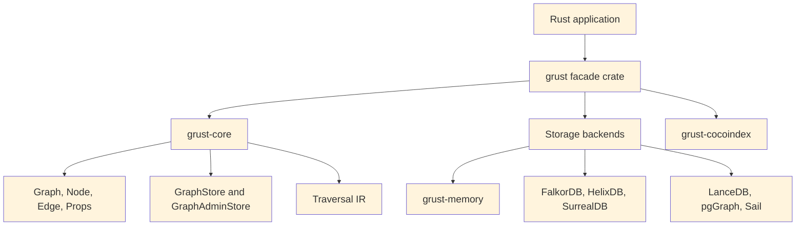
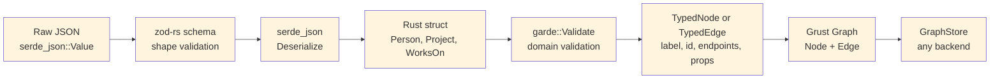
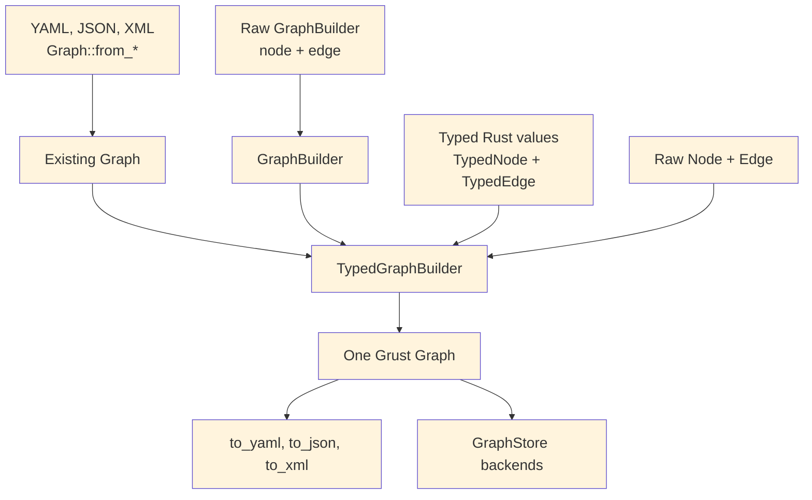
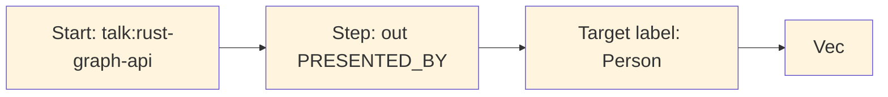
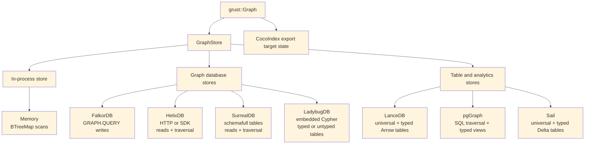
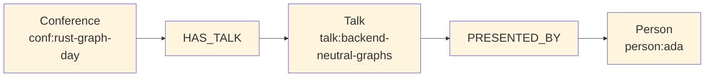
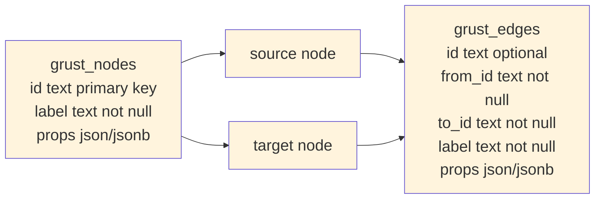

# Preface

Grust is a small Rust property graph API with a large architectural promise:
application code should be able to build, validate, traverse, and persist graph
data without committing itself to a database query language too early.

That goal matters because many graph-shaped Rust applications live between
worlds. A crawler wants a local graph while it extracts facts. An indexing
pipeline wants deterministic target state. A data product may begin with tests
and an in-memory backend, then later need SurrealDB, FalkorDB, PostgreSQL,
LanceDB, Sail, or another backend. Grust gives those applications one model to
program against:

```text
Graph = nodes + edges
Node  = id + label + properties
Edge  = optional id + from + to + label + properties
```

This book is a guided tour of that model. It covers the workspace architecture,
the Rust concepts the code leans on, the core graph types, traversal IR, backend
contracts, implemented backends, proposed backends, and practical examples.

# 1. The Shape of Grust

Grust is not trying to be every graph library for Rust. It is not an algorithm
crate like `petgraph`, and it is not a thin wrapper around a single database. It
is a property graph layer: a compact model of labeled nodes, labeled edges, and
typed properties that can be carried across storage engines.

The current workspace is arranged around one core crate, one public facade, and
backend or integration crates:



The `grust-core` crate owns the durable concepts. It defines identifiers,
labels, property values, graph builders, schemas, traversals, error types, load
reports, and backend traits. The `grust` crate re-exports those pieces and gates
backend crates behind Cargo features.

Core also owns the small lowering helpers that have to mean the same thing
everywhere. `relationship_type` normalizes edge labels for backends that need
database-safe relationship names. `schema_identifier` normalizes schema labels
and fields for SQL-like typed surfaces. `edge_key` gives table and export
backends the same structural fallback key for an edge when the caller has not
provided an explicit `EdgeId`.

That split is important. Core model code stays light, deterministic, and mostly
dependency-free. Backends are allowed to depend on Redis, SurrealDB, LanceDB,
PostgreSQL, Spark Connect, HTTP clients, gRPC clients, or SDKs without dragging
those dependencies into every Grust user.

# 2. The Core Property Graph

At the center of Grust are three public data structures:

```rust
pub struct Graph {
    pub nodes: Vec<Node>,
    pub edges: Vec<Edge>,
}

pub struct Node {
    pub id: NodeId,
    pub label: Label,
    pub props: Props,
}

pub struct Edge {
    pub id: Option<EdgeId>,
    pub from: NodeId,
    pub to: NodeId,
    pub label: Label,
    pub props: Props,
}
```

`NodeId`, `EdgeId`, and `Label` are newtypes over `String`. They are small
wrappers, but they carry meaning through Rust's type system. A function that
expects a `Label` cannot accidentally receive an `EdgeId` without an explicit
conversion. The wrappers implement common conversion traits such as `From<&str>`
and `From<String>`, so the public API remains ergonomic.

Properties are stored in a `BTreeMap<String, Value>`:

```rust
pub enum Value {
    Null,
    Bool(bool),
    Int(i64),
    Float(f64),
    String(String),
    StringArray(Vec<String>),
    Json(serde_json::Value),
}
```

The use of `BTreeMap` is a quiet but useful choice. Iteration order is stable,
which makes generated JSON, tests, and backend query generation more
predictable. That is especially helpful in a project whose backends turn one
graph into SQL, Cypher-like queries, Arrow batches, JSON target state, or SDK
calls.

`Node::new` also inserts an `id` property if one is not already present. That
means a Grust node has a first-class typed identity and an ordinary property
view of that identity, which helps backends that identify records through
property maps.

# 3. Building Graphs

Most application code should not construct every `Node` and `Edge` by hand. It
should use `GraphBuilder`:

```rust
use grust::prelude::*;

let mut builder = GraphBuilder::new();

let talk = builder
    .node("Talk", "talk:rust-graph-api")
    .prop("title", "A Modern Graph API for Rust")
    .prop("year", 2026_i64)
    .finish();

let speaker = builder
    .node("Person", "person:ada")
    .prop("name", "Ada Example")
    .finish();

builder
    .edge("PRESENTED_BY", &talk, &speaker)
    .prop("source", "conference-schedule")
    .finish();

let graph = builder.build();
```

The builder deduplicates nodes by `NodeId`. If an existing node has the same
label, additional properties are merged into it. Edges default to
`EdgePolicy::DedupeByFromLabelTo`, so the tuple `(from, label, to)` is treated
as the relationship identity. Domains that need true multi-edges can opt into
`EdgePolicy::AllowDuplicates`.

```rust
let mut builder = GraphBuilder::new()
    .edge_policy(EdgePolicy::AllowDuplicates);
```

This is an example of Grust's overall style: put the common property-graph case
on the simple path, but leave an explicit escape hatch for graph models with
different identity rules.

## Loading and Saving Graph Documents

A `Graph` can also move through textual document formats without touching a
backend. The core crate exposes paired constructors and serializers for YAML,
JSON, and XML:

```rust
let graph = Graph::from_yaml(yaml_text)?;
let yaml_text = graph.to_yaml()?;

let graph = Graph::from_json(json_text)?;
let json_text = graph.to_json()?;

let graph = Graph::from_xml(xml_text)?;
let xml_text = graph.to_xml()?;
```

These methods are useful for fixtures, migration inputs, examples, audits, and
small graph interchange files. They all feed the same validation path, so a
document with duplicate node ids or an edge that points at a missing node fails
before it reaches a store.

YAML and JSON share the same document shape. A property value can be written as
a plain JSON-like scalar when the type is obvious, or as the tagged Grust
`Value` representation when the exact variant matters:

```json
{
  "nodes": [
    {
      "id": "talk:rust-graph-api",
      "label": "Talk",
      "props": {
        "title": "A Modern Graph API for Rust",
        "year": 2026,
        "tracks": {
          "type": "string_array",
          "value": ["rust", "graphs"]
        }
      }
    },
    {
      "id": "person:ada",
      "label": "Person",
      "props": {
        "name": "Ada Example"
      }
    }
  ],
  "edges": [
    {
      "label": "PRESENTED_BY",
      "from": "talk:rust-graph-api",
      "to": "person:ada",
      "props": {
        "source": "conference-schedule"
      }
    }
  ]
}
```

The XML form is more explicit because XML has no native object or array type.
Properties are represented as repeated `prop` entries with a `key` and a tagged
`value`:

```xml
<graph>
  <nodes>
    <node>
      <id>talk:rust-graph-api</id>
      <label>Talk</label>
      <props>
        <prop>
          <key>title</key>
          <value>
            <type>string</type>
            <value>A Modern Graph API for Rust</value>
          </value>
        </prop>
      </props>
    </node>
    <node>
      <id>person:ada</id>
      <label>Person</label>
    </node>
  </nodes>
  <edges>
    <edge>
      <label>PRESENTED_BY</label>
      <from>talk:rust-graph-api</from>
      <to>person:ada</to>
    </edge>
  </edges>
</graph>
```

Serialization removes the generated `id` property from node property maps when
it only mirrors the node's `NodeId`. That keeps exported documents readable
without changing what `Node::new` guarantees after loading.

# 4. Typed Graph Ingestion with garde and zod-rs

The core `Graph`, `Node`, and `Edge` types are intentionally dynamic. A node has
a label and a property map; an edge has a label, endpoints, and a property map.
That dynamic shape is the right interchange format for backends, graph
documents, audits, and cross-system movement. Application code, however, often
starts with typed Rust structs: a `Person`, a `Project`, a `WorksOn`
relationship, or some domain-specific event. Grust's typed ingestion layer
connects those two worlds.

The typed layer is optional. It is enabled through Cargo features:

```toml
[dependencies]
grust = { package = "grust-graph", version = "0.9.0", features = ["typed-garde"] }
```

`typed-garde` adds Rust-struct validation and typed lowering. A second feature,
`typed-zod-rs`, layers raw JSON shape validation on top:

```toml
[dependencies]
grust = { package = "grust-graph", version = "0.9.0", features = ["typed-zod-rs"] }
```

`typed-zod-rs` implies `typed-garde`. That relationship matters: zod-rs checks
untrusted JSON shape first, Serde turns the JSON into Rust values, and garde
checks typed domain invariants before Grust lowers the value into a normal
`Node` or `Edge`.



The important promise is that typed ingestion does not create a second graph
model. Once validation succeeds, everything becomes the ordinary Grust graph
shape. Backends do not need to know whether a node came from `GraphBuilder`, a
YAML document, a typed Rust struct, or a zod-rs-validated JSON payload.

## garde: Typed Rust Validation

`garde` is a Rust validation library built around a derive macro. You attach
validation rules to fields, derive `garde::Validate`, and then call
`validate()` or `validate_with(...)`. The rules live near the Rust type, so they
travel with the domain model instead of being hidden in a loader function.

Common garde rules include:

- `length(min = 1)` for nonempty strings and collections.
- `range(min = 1, max = 100)` for numeric bounds.
- `inner(...)` for validating items inside a collection.
- `custom(...)` for domain-specific validation functions.
- `dive` for validating nested values that also implement `Validate`.

In Grust, a typed node implements `TypedNode`. It supplies a graph label and a
stable node id. The default property conversion serializes the struct through
Serde and converts the resulting object fields into Grust properties:

```rust
use grust::prelude::*;
use grust::typed::garde;
use serde::Serialize;

#[derive(Debug, Serialize, garde::Validate)]
#[garde(allow_unvalidated)]
struct Person {
    #[garde(length(min = 1))]
    id: String,
    #[garde(length(min = 1))]
    name: String,
    #[garde(length(min = 1), inner(length(min = 1)))]
    skills: Vec<String>,
}

impl TypedNode for Person {
    const LABEL: &'static str = "Person";

    fn node_id(&self) -> NodeId {
        format!("person:{}", self.id).into()
    }
}
```

Typed edges implement `TypedEdge`. They provide a label and endpoint ids:

```rust
#[derive(Debug, Serialize, garde::Validate)]
#[garde(allow_unvalidated)]
struct WorksOn {
    #[garde(length(min = 1))]
    person_id: String,
    #[garde(length(min = 1))]
    project_id: String,
    #[garde(range(min = 1, max = 100))]
    allocation_percent: u8,
}

impl TypedEdge for WorksOn {
    const LABEL: &'static str = "WORKS_ON";

    fn source_node_id(&self) -> NodeId {
        format!("person:{}", self.person_id).into()
    }

    fn target_node_id(&self) -> NodeId {
        format!("project:{}", self.project_id).into()
    }
}
```

`TypedGraphBuilder` validates and lowers these values:

```rust
let mut builder = TypedGraphBuilder::new();

builder.add_node(&Person {
    id: "nia".to_string(),
    name: "Nia".to_string(),
    skills: vec!["rust".to_string(), "graphs".to_string()],
})?;

builder.add_edge(&WorksOn {
    person_id: "nia".to_string(),
    project_id: "grust".to_string(),
    allocation_percent: 80,
})?;

let graph = builder.build();
```

Validation fails before graph construction. If `allocation_percent` is `0`, the
`range(min = 1, max = 100)` rule produces a Grust schema error and the edge is
not added. This keeps invalid domain facts out of the graph rather than relying
on a backend to reject them later.

Typed values can also be reconstructed from ordinary Grust reads. The read path
decodes node or edge properties back through serde, runs garde validation, and
checks that the typed identity still matches the graph value:

```rust
let stored = store
    .get_node(&NodeId::new("person:nia"))
    .await?
    .expect("person exists");

let person = Person::from_node(&stored)?;
assert_eq!(person.id, "nia");
```

Edges follow the same pattern with `WorksOn::from_edge(&edge)?`. For validation
contexts, use `from_node_with` or `from_edge_with`.

## Typed and Untyped Graphs Coexist

The typed layer is an ingestion layer over the ordinary `GraphBuilder`. It does
not force an all-or-nothing choice. A graph can start as a document, accept raw
nodes and edges, and then be extended with typed values:

```rust
let existing = Graph::new(
    vec![Node::new("Document", "doc:garde-proposal", Props::new())],
    Vec::new(),
);

let mut builder = TypedGraphBuilder::from_graph(existing);

builder.add_node(&Person {
    id: "nia".to_string(),
    name: "Nia".to_string(),
    skills: vec!["rust".to_string(), "graphs".to_string()],
})?;

builder.add_raw_edge(Edge::new(
    "AUTHORED",
    "person:nia",
    "doc:garde-proposal",
    Props::new(),
));

let graph = builder.build();
```

The coexistence API is explicit:

- `TypedGraphBuilder::from_graph(graph)` starts from an existing `Graph`.
- `TypedGraphBuilder::from_builder(builder)` starts from an existing
  `GraphBuilder`.
- `add_raw_node(node)` and `add_raw_edge(edge)` add ordinary Grust values.
- `into_builder()` returns the inner `GraphBuilder` when lower-level builder
  operations are needed.



This is useful during migrations. A project can keep loading existing graph
documents while adding typed definitions for the domain facts that benefit most
from Rust validation. Over time, more labels can move to typed constructors
without breaking the storage or document formats.

## What Zod Means Here

Zod is best known from TypeScript. It lets developers define a runtime schema
and validate untrusted input before treating it as application data. In
TypeScript, this closes an important gap: static types disappear at runtime, so
a value received from JSON, an HTTP request, a form, or a message queue still
needs runtime validation.

Rust has a different type system, but the boundary problem still exists.
External data arrives as bytes or JSON. Serde can deserialize those bytes into a
Rust struct, but it is often useful to separate two questions:

1. Does this JSON have the expected shape?
2. Does the resulting Rust value satisfy my domain rules?

`zod-rs` answers the first question. `garde` answers the second. Grust's
`typed-zod-rs` feature wires those stages together:

```rust
use grust::prelude::*;
use serde::{Deserialize, Serialize};
use serde_json::json;
use zod_rs::prelude::{Schema, number, object, string};

#[derive(Debug, Deserialize, Serialize, garde::Validate)]
#[garde(allow_unvalidated)]
struct Person {
    #[garde(length(min = 1))]
    id: String,
    #[garde(length(min = 1))]
    name: String,
    #[garde(length(min = 1), inner(length(min = 1)))]
    skills: Vec<String>,
}

impl TypedNode for Person {
    const LABEL: &'static str = "Person";

    fn node_id(&self) -> NodeId {
        format!("person:{}", self.id).into()
    }
}

let person_schema = object()
    .field("id", string().min(1))
    .field("name", string().min(1))
    .field("skills", string().min(1).array())
    .strict();

let json = json!({
    "id": "nia",
    "name": "Nia",
    "skills": ["rust", "graphs"]
});

let person: Person = parse_typed_json(&person_schema, &json)?;
```

The same schema can feed the graph builder directly:

```rust
let mut builder = TypedGraphBuilder::new();
builder.add_node_from_json::<Person, _>(&person_schema, &json)?;
```

For edges, the pattern is the same:

```rust
#[derive(Debug, Deserialize, Serialize, garde::Validate)]
#[garde(allow_unvalidated)]
struct WorksOn {
    #[garde(length(min = 1))]
    person_id: String,
    #[garde(length(min = 1))]
    project_id: String,
    #[garde(range(min = 1, max = 100))]
    allocation_percent: u8,
}

impl TypedEdge for WorksOn {
    const LABEL: &'static str = "WORKS_ON";

    fn source_node_id(&self) -> NodeId {
        format!("person:{}", self.person_id).into()
    }

    fn target_node_id(&self) -> NodeId {
        format!("project:{}", self.project_id).into()
    }
}

let works_on_schema = object()
    .field("person_id", string().min(1))
    .field("project_id", string().min(1))
    .field("allocation_percent", number().int().min(1.0).max(100.0))
    .strict();

builder.add_edge_from_json::<WorksOn, _>(
    &works_on_schema,
    &json!({
        "person_id": "nia",
        "project_id": "grust",
        "allocation_percent": 80
    }),
)?;
```

The adapter intentionally deserializes the original JSON after zod-rs accepts
it. This preserves Rust integer types. For example, `zod-rs` validates numbers
through a floating-point schema, but Serde should still be allowed to decode the
original JSON integer `80` into a Rust `u8`.

## How the Options Interact

There are four common construction paths:

```text
Raw GraphBuilder:
  trusted Rust code -> Node/Edge -> Graph

Graph documents:
  YAML/JSON/XML -> Graph::from_* validation -> Graph

typed-garde:
  Rust struct -> garde validation -> TypedNode/TypedEdge lowering -> Graph

typed-zod-rs:
  raw JSON -> zod-rs shape validation -> Serde -> garde validation -> Graph
```

Choose `GraphBuilder` when the data is already trusted Rust code and the
dynamic graph model is enough. Choose graph documents when you need readable
fixtures, interchange files, or migration inputs. Choose `typed-garde` when the
domain model lives in Rust structs and should enforce Rust-level invariants.
Choose `typed-zod-rs` when the input is untrusted JSON and you want a separate
shape gate before Serde and garde.

These options compose. A single graph can contain nodes loaded from YAML, raw
edges added by `GraphBuilder`, typed nodes validated by garde, and request
payloads validated first by zod-rs. The result is still just `Graph`.

The distinction between zod-rs and garde is worth keeping crisp:

- zod-rs sees `serde_json::Value`.
- Serde converts JSON into Rust types.
- garde sees Rust fields with Rust types.
- `TypedNode` and `TypedEdge` convert validated Rust values into Grust labels,
  ids, endpoints, and properties.

For example, this JSON fails at the zod-rs stage because `skills` is not an
array:

```json
{
  "id": "nia",
  "name": "Nia",
  "skills": "rust"
}
```

This JSON can pass a loose zod-rs shape check but fail at the garde stage if the
Rust type requires at least two skills:

```json
{
  "id": "nia",
  "name": "Nia",
  "skills": ["rust"]
}
```

That separation gives application authors precise error boundaries. Shape
errors usually belong near the API or file-ingest boundary. Domain errors belong
near the typed model.

## Relationship to GraphSchema

`GraphSchema` and typed ingestion solve different problems. `GraphSchema`
describes graph labels, fields, uniqueness, and backend-facing metadata. It can
drive indexes, migrations, table layouts, or validation inside a store. Typed
ingestion validates values before they become graph data.

In practice they can reinforce each other:

- `TypedNode` and `TypedEdge` keep application construction honest.
- zod-rs schemas protect JSON ingress points.
- `GraphSchema` tells storage backends what structure to expect.
- `GraphStore` remains the common persistence contract.

This layered design keeps Grust from becoming either too loose or too rigid.
Projects can start with raw graph construction, add typed Rust validation for
important labels, add zod-rs for JSON ingress, and later add `GraphSchema` for
backend optimization.

The same schema can also validate and write in one step:

```rust
let report = store.put_typed_graph(&schema, &graph).await?;
```

That call validates labels, required fields, field value types, and edge
endpoint labels before delegating to the backend. Schema-capable stores then use
`apply_schema` to lower the portable model into their native storage surfaces.

# 5. Traversal as an Intermediate Representation

Grust traversal is not Cypher, SQL, GQL, SurrealQL, Spark SQL, or a graph
database dialect. It is a small Rust intermediate representation:

```rust
let traversal = Traversal::from_node("talk:rust-graph-api")
    .out("PRESENTED_BY")
    .to("Person")
    .limit(10);
```

A traversal has a start expression, a sequence of steps, and an optional limit.
The start can be a single node, all nodes with a label, or nodes with a property
value. Each step has a direction, an optional edge label, and an optional target
node label.



The IR is deliberately modest. That makes it implementable across a wide range
of backends. The memory backend can scan maps. LanceDB can query tables by hop.
pgGraph can lower to SQL over universal graph tables. Sail can lower to Spark
SQL through Spark Connect. Backends that do not yet support reads can return
`GrustError::Unsupported`.

This design also protects application code. A caller asks for a graph-shaped
operation; the backend decides whether that operation becomes a map scan, a SQL
join, a DataFrame query, a Redis graph command, or a future native graph query.

For local analytics and backend planning, `grust-core` also exposes
`GraphIndex`. It builds a dense vertex index from a `Graph`, validates that
every edge endpoint exists, and stores incoming and outgoing edge indexes per
vertex. That gives adapters and examples one shared adjacency layer instead of
rebuilding node-id maps in each backend. The `grust-graph` facade includes a
dependency-free `benchmarks` example that exercises graph cloning,
`GraphIndex` construction, degree scans, endpoint scans, and structural
edge-key generation over ring, grid, layered, clustered, Graph500-style R-MAT,
and GAP-style R-MAT graph families.

# 6. The Store Contract

The central backend trait is `GraphStore`:

```rust
#[async_trait::async_trait]
pub trait GraphStore: Send + Sync {
    async fn apply_schema(&self, schema: &GraphSchema) -> Result<()>;
    async fn put_node(&self, node: &Node) -> Result<PutOutcome>;
    async fn put_edge(&self, edge: &Edge) -> Result<PutOutcome>;
    async fn put_graph(&self, graph: &Graph) -> Result<LoadReport>;
    async fn put_typed_graph(&self, schema: &GraphSchema, graph: &Graph) -> Result<LoadReport>;
    async fn get_node(&self, id: &NodeId) -> Result<Option<Node>>;
    async fn get_nodes(&self, ids: &[NodeId]) -> Result<Vec<Node>>;
    async fn get_edges(&self, query: EdgeQuery) -> Result<Vec<Edge>>;
    async fn traverse(&self, traversal: Traversal) -> Result<Vec<Node>>;
}
```

The trait is async because real graph stores usually cross a process, network,
database, or object-store boundary. The `async_trait` crate hides the current
limitations around async functions in object-safe traits and lets backend
implementations present one uniform interface.

`put_graph` takes `&Graph` instead of consuming `Graph`. That keeps retry,
audit, comparison, and multi-backend loading workflows straightforward:

```rust
let report = store.put_graph(&graph).await?;
backup_store.put_graph(&graph).await?;
println!("loaded {} nodes and {} edges", report.nodes, report.edges);
```

Single-element writes return `PutOutcome`. Memory and builder paths can report
precise inserted/updated/deduped outcomes. Remote upsert-oriented backends
commonly return `Upserted` because distinguishing insert from update would
require an extra read or a backend-specific write primitive. Portable callers
should treat all written outcomes as success rather than depending on
inserted-versus-updated. `LoadReport` counts elements that were written or
upserted, not necessarily newly created rows.

Administrative operations are split into `GraphAdminStore`:

```rust
#[async_trait::async_trait]
pub trait GraphAdminStore: GraphStore {
    async fn bootstrap(&self) -> Result<()> { Ok(()) }
    async fn clear(&self) -> Result<()>;
}
```

This separation keeps ordinary application persistence apart from setup and
destructive workflows. A production service may receive a `GraphStore`, while a
test harness or migration tool can require `GraphAdminStore`.

# 7. Rust Concepts Used

Grust is a good example of idiomatic Rust applied to a storage abstraction.

Newtypes give semantic weight to strings. `NodeId`, `EdgeId`, and `Label` are
cheap wrappers, but they prevent accidental parameter swaps and produce clearer
APIs.

Trait-based polymorphism defines the backend boundary. Application code can be
generic over `impl GraphStore`, while each backend owns its own connection,
configuration, batching, serialization, and query strategy.

Feature flags keep the facade crate light. The public `grust` crate re-exports
backend crates only when features such as `memory`, `lancedb`, `pggraph`,
`sail`, `falkor`, `helix`, `surreal`, or `cocoindex` are enabled.

Serde makes the graph model portable. Core types derive `Serialize` and
`Deserialize`, and backends can turn properties into JSON strings, JSONB,
Arrow string columns, or target-state maps.

Interior mutability appears where it is appropriate. The memory backend stores
its graph behind `Arc<RwLock<...>>`, making cloned stores share state while
keeping mutation synchronized.

Error typing is explicit. `GrustError` distinguishes backend, schema,
unsupported-feature, and serialization failures. That lets a caller tell the
difference between "the database rejected this" and "this backend does not yet
support traversal."

# 8. Backend Architecture

Backends share the same input model but not the same execution model:



Some backends are full read/write/traversal stores today. Others still focus on
writes and administrative loading. That is normal for an early multi-backend
project, and the trait makes the maturity boundary explicit.

## Memory

`grust-memory` is the deterministic local backend. It stores nodes in a
`BTreeMap<NodeId, Node>` and edges in a `BTreeMap<(NodeId, Label, NodeId), Edge>`.
Reads and traversals scan those maps. It is the best backend for tests, examples,
and local workflows that need no external service.
When a `GraphSchema` is applied, the memory backend validates writes against it,
which makes it a useful conformance harness for typed storage behavior before a
database enters the picture.

```rust
use grust::prelude::*;

# async fn demo(graph: Graph) -> grust::Result<()> {
let store = MemoryGraphStore::new();
store.put_graph(&graph).await?;

let people = store
    .traverse(
        Traversal::from_node("talk:rust-graph-api")
            .out("PRESENTED_BY")
            .to("Person"),
    )
    .await?;
# Ok(())
# }
```

## LanceDB

`grust-lancedb` treats LanceDB first as a durable Arrow-native table store. It
uses two tables, one for nodes and one for edges. Nodes are keyed by `id`. Edges
are keyed by an explicit edge id when present, or by a deterministic
`from + label + to` key otherwise. That fallback key is shared with other
tabular/export backends through `grust-core::edge_key`, so structural edge
identity does not drift across implementations. Writes use LanceDB
`merge_insert`, and traversal performs hop-by-hop table queries. When a hop fans
out to multiple target nodes, the backend reads those target nodes with
`get_nodes` instead of issuing one node query per edge. Property-start
traversal filters by label in LanceDB, then compares decoded Grust properties
exactly so nested JSON or serialized fragments cannot produce false positives.

This backend is a natural home for later vector-search extensions. The core
`GraphStore` trait should stay graph-focused; LanceDB-specific nearest-neighbor
search can live in an extension trait without leaking into every backend.

With `GraphSchema`, LanceDB also creates typed Arrow tables per node and edge
label. The universal `grust_nodes` and `grust_edges` tables remain the portable
read/traversal surface, while schema-labeled rows are mirrored into tables such
as `grust_node_person` or `grust_edge_presents` with typed columns for declared
fields. That gives analytical consumers and future vector extensions a native
columnar surface without giving up the backend-neutral graph model.

## LadybugDB

`grust-ladybug` embeds LadybugDB directly through the Rust `lbug` crate. It is
the durable local graph-database backend: no Docker service, no HTTP bridge,
and no separate daemon. The store opens either an in-memory Ladybug database or
an on-disk Ladybug directory and creates Grust-managed Ladybug node and
relationship tables from graph labels.

Ladybug can be used for typed or untyped property graphs, and the Grust backend
now exposes that distinction directly. The default `LadybugGraphMode::Untyped`
accepts ordinary Grust graphs and creates the needed Ladybug node and
relationship tables from graph labels and endpoint labels on write. That mode
matches Grust's raw `Graph`, JSON, YAML, and XML loading path, where labels and
properties are data owned by the application.

`LadybugGraphMode::Typed` requires `apply_schema` or `put_typed_graph` before
writes. In that mode the backend creates the declared Ladybug tables up front,
does not create undeclared tables during writes, and validates later writes
against the applied `GraphSchema`. Reads reconstruct Grust `Node` and `Edge`
values from the managed tables, while traversal evaluates the portable Grust
traversal IR by walking Ladybug relationship tables and reading target nodes
through the same `GraphStore` contract.

The `ladybug-arrow` facade feature also exposes Ladybug's embedded Arrow table
path through Arrow IPC streams. A caller can register IPC node tables,
relationship tables, and CSR relationship tables directly with Ladybug, then
query them with Ladybug Cypher and receive result chunks back as Arrow IPC. The
public boundary is IPC bytes rather than a Rust `RecordBatch` type, so callers
do not have to match Ladybug's internal Arrow crate version exactly.

The first implementation stores Grust properties as JSON text for portable
round trips. Later schema lowering can add typed Ladybug columns, full-text
indexes, vector indexes, and direct graph-RAG extension traits without changing
the core graph model.

## pgGraph

`grust-pggraph` stores the source of truth in ordinary PostgreSQL tables:

```sql
grust_nodes(id text primary key, label text not null, props jsonb not null)
grust_edges(id text, from_id text not null, to_id text not null,
            label text not null, props jsonb not null)
```

The backend can bootstrap the `graph` extension, create tables and indexes,
register graph tables, and optionally build the pgGraph projection. Reads use
SQL against the universal tables. Traversal is lowered to SQL joins over those
tables, with pgGraph projection support available as the backend matures.
Mutation batches are wrapped in PostgreSQL transactions.

Schema application adds typed label views and expression indexes. For example,
a `Person` node schema with `name: String` and `age: Int` can produce a
`grust_node_person` view over the universal node table, with `age` exposed as a
`bigint` expression. This is a deliberately incremental typed-storage path:
PostgreSQL keeps the flexible JSONB source of truth while callers that know the
schema get typed SQL surfaces.

## Sail

`grust-sail` connects to a Sail Spark Connect server over gRPC. It stores graph
data in Spark DataFrames backed by Delta tables. SQL commands and reads are
sent as Spark Connect SQL relation plans, and read results are decoded from
Arrow IPC streams.

Bulk writes stage Arrow IPC batches as Spark Connect `LocalRelation` temp views
and then merge from those views. That avoids building one giant SQL literal per
row, keeps user values out of SQL text, and gives long-running requests an
operation id with reattachment enabled. Query filters bind user values through
Spark Connect named arguments. Delete mutations stage their values as Arrow
temp views before running argument-free SQL commands, which avoids string
substitution while matching Sail's current command-parameter behavior.
Traversal joins use globally unique node ids; source and destination label
columns may be empty for single-edge writes where the full graph is not in
scope.

Sail's Arrow boundary is now public too. Applications can stage arbitrary Arrow
IPC streams as session temp views and query them with Spark SQL, collect Spark
SQL results as Arrow IPC chunks, or load Grust-shaped node and edge IPC streams
through the normal graph write path. This gives Sail the same data-source role
as Ladybug while keeping Sail's internal Arrow 58 dependency separate from
Ladybug's Arrow 55 dependency.

When a schema is applied, Sail creates typed Delta tables per node and edge
label and mirrors writes into them with `MERGE INTO`. The universal Spark
tables keep traversal simple and portable; the typed tables make declared graph
labels available as ordinary Spark columns.

Sail also has reusable graph analytics helpers over the persisted generic
tables. `read_graph` collects the generic `grust_nodes` and `grust_edges`
tables back into a portable Grust `Graph`. `in_degrees`, `out_degrees`,
`degrees`, and `degree_pairs` run Spark SQL over those same tables and decode
the Arrow results into small Rust row types. These helpers are deliberately
low-level: they expose common graph measurements without making the
backend-neutral `GraphStore` trait depend on Spark-specific analytics.

The Sail crate now also publishes its generic table contract. Constants name
`grust_nodes`, `grust_edges`, and the physical node and edge columns, including
the persisted generic edge `edge_key` and optional explicit edge `id`.
Projection helpers classify requested graph fields as physical columns or JSON
properties, map edge `label` to the stored `edge_type`, and check when a typed
Sail node or edge table can satisfy a graph query directly. This keeps
Sail-native graph planning and GrustFrames-style distributed lowerings aligned
with the same backend layout that Grust writes.

The same contract layer exposes typed table descriptors derived from
`GraphSchema` and directional triplet SQL. The triplet helpers join generic
edges back to their source and destination nodes, and can orient rows as
outgoing, incoming, or undirected pairs. That is the shared primitive needed by
distributed triplet filters, motif expansion, and aggregate-message style
passes without making the backend-neutral store trait depend on those higher
level algorithms.

Writable Cypher in Sail follows the same rule. `sail_cypher_mutation_plan`
accepts only a strict v1 mutation subset: explicit-ID node `CREATE` and
`MERGE`, edge `CREATE` and `MERGE` when both endpoint IDs are resolved, and
resolved node or edge `DELETE`. It also accepts ordered multi-statement
batches, local node variables bound by explicit-ID node patterns, ID-resolved
`MATCH ... DELETE`, edge `MATCH ... CREATE` / `MATCH ... MERGE`, and
cardinality-aware broad node
`MATCH ... DELETE` / `MATCH ... SET n += { ... }` / `MATCH ... SET n.key = value`
/ `MATCH ... REMOVE n.key` forms, plus ID-resolved edge
`MATCH ... SET e += { ... }`, literal property assignment, and explicit
property `REMOVE` when the node or edge identity is resolved, row-producing
edge `MATCH ... CREATE` and `MATCH ... MERGE` when both endpoints come from
matched node variables, plus broad
relationship `MATCH ... DELETE` / `MATCH ... SET e += { ... }` /
`MATCH ... SET e.key = value` / `MATCH ... REMOVE e.key` over endpoint
predicates. It lowers those
statements into `GraphMutationPlan` and then ordinary `GraphMutation` values.
The execution entrypoint, `SailGraphStore::execute_cypher_mutation`, runs those
mutations through `GraphMutationStore`, so Cypher writes use the same staged
Arrow, `MERGE INTO`, typed-table mirror, and delete paths as normal Grust
writes. When callers need stricter Cypher compatibility, the options entrypoint
can make `CREATE` fail if the target node or edge identity already exists. That
mode performs a read-before-write check and therefore keeps the default
entrypoint on the lower-friction upsert-compatible path. Generated node IDs are
also caller-selected rather than implicit: `CypherNodeIdPolicy::GenerateForCreate`
allows node `CREATE` without an `id`, and the result API returns generated IDs
separately from the count-oriented mutation report. Callers can also opt into
written node and edge identity payloads. Node payloads cover explicit and
generated node writes; edge payloads cover resolved and row-producing edge
writes. These payloads describe accepted writes rather than exact
insert-versus-update outcomes on upsert backends. `MERGE` and edge endpoint
patterns still require resolved IDs before writing.
The first table-returning write path is deliberately smaller than general
Cypher `RETURN`: `execute_cypher_mutation_returning_with_options` accepts a
final property projection over node variables and concrete relationship
variables already resolved by the write plan and returns
`CypherMutationTableResult`, which keeps mutation reporting separate from
`CypherResultTable`. Aggregation, paths, broad matched-row relationship
returns, ordering, limiting, and arbitrary read-query features remain rejected
until a shared read/write row model owns those semantics.
`CypherMutationOptions::parameters` binds Grust `Value`s to `$name`
placeholders only where literals are already accepted: IDs, property maps, and
literal property assignments. Quoted `'$name'` remains ordinary string text
rather than a parameter reference. Mutating `MATCH` clauses can use a bounded
`WHERE` grammar: property comparisons against literals or parameters joined by
`AND`, for example `WHERE n.status = 'inactive' AND n.score >= $min`.
Predicates lower to backend-neutral `GraphPropertyPredicate` values, so Memory
evaluates the same resolved plan that Sail lowers to SQL. Missing properties
never match; `null` only matches equality or inequality against `Value::Null`,
and ordered comparisons are limited to numbers or strings.
`CypherMutationOptions::null_assignment`
defaults to storing `SET x.key = null` as `Value::Null`, but callers can choose
`CypherNullAssignment::RemoveProperty` to lower explicit null assignment to the
same property-removal operations used by `REMOVE`; map patches such as
`SET x += {key: null}` always store `Value::Null`. `MATCH ... SET` clauses can
contain comma-separated assignments, and each assignment is lowered as its own
ordered plan operation so repeated property targets preserve source order while
still using only the supported literal, map patch, remove-on-null, and numeric
node update forms. The first expression form is deliberately small: node
property assignment can read a property on the same node variable and apply
`+`, `-`, `*`, or `/` with an integer or float literal or parameter. That
lowers to an explicit read-modify-write mutation plan instead of hidden
parser-side arithmetic. Resolved mutation-plan execution is
backend-neutral through `CypherMutationExecutor`: Sail still owns text parsing, but the
resulting `GraphMutationPlan` can execute on Sail or on the in-memory backend
for deterministic tests. Backends that cannot execute a plan operation report
a structured Cypher execution error. The Sail parser has an internal
front-door boundary that classifies top-level mutation statements before
lowering; a shared parser crate remains deferred until there is a second
Cypher text parser consumer. Mutation batch
atomicity is explicit through `GraphMutationAtomicity`: the default path is
ordered but not atomic, while pgGraph and SurrealDB report transactional batch
execution because they wrap mutation batches in backend transactions.
ID-resolved and broad
node `MATCH ... SET n += { ... }` lower to node patch mutations; `null` in the
patch map is stored as `Value::Null` rather than treated as property removal.
ID-resolved edge `MATCH ... SET e += { ... }` lowers to an edge patch mutation
and reuses the same typed-edge mirror writes as ordinary edge upserts.
Row-producing edge `MATCH ... CREATE` and `MATCH ... MERGE` materialize matched
endpoint node pairs before writing, report matched rows separately from
attempted edge upserts, and still reject trailing node creation or explicit
relationship IDs in the row-producing form. The current report does not
distinguish newly inserted merge rows from rows that already existed.
Literal `SET n.key = value` and `SET e.key = value` lower to one-key patches,
while `REMOVE n.key` and `REMOVE e.key` lower to explicit property-remove
mutations. Node forms can target either a resolved identity or a broad node
match; edge forms can target either a resolved identity or a broad relationship
match. Broad relationship matches can filter on relationship property
predicates beyond `id`; explicit edge `id` remains a separate identity filter
and can be combined with ordinary relationship predicates. Relationship
expression updates and general computed expressions remain deferred.
For broad node and relationship deletes, patches, and property removals, the
report records matched rows and changed graph elements, and Sail stages matched
IDs before using the same delete or load helpers that keep generic and typed
tables consistent. The
mutation parser keeps top-level
keywords case-insensitive and strips Cypher comments outside string literals.
Callers can distinguish Cypher syntax, unresolved identity, unsupported
cardinality, and execution failures through structured `GrustError` variants.
Execution remains Sail-specific for now, while the mutation plan and report
types stay backend-neutral.

## FalkorDB, HelixDB, and SurrealDB

The FalkorDB backend writes through Redis `GRAPH.QUERY` using Cypher-like
`MERGE` statements. It batches nodes by label path and edges by relationship
type. Schema application creates label/property indexes for declared node
types.

The HelixDB backend has HTTP and SDK stores. Both support batched writes, node
reads, edge reads, and backend-neutral traversal through Helix dynamic queries.
Edge writes store Grust relationship metadata (`relationship`, `from_id`,
`to_id`, and optional `edge_id`) so `EdgeQuery` can reconstruct Grust edges from
Helix relationship rows. Helix writes preserve supported scalar and array
properties instead of silently dropping non-string values; unsupported JSON
object properties return an explicit error. The current schema hook validates
that labels, relationships, and fields can be safely lowered through the
dynamic-query path; backend-native schema-file generation can build on that same
`GraphSchema` contract later.

The SurrealDB backend also has HTTP and SDK stores. It can bootstrap, clear,
upsert nodes, relate edges, delete nodes and edges, read nodes and edges, and
execute traversal hop-by-hop through the `GraphStore` contract. Applying a
schema lowers node and edge declarations to Surreal `DEFINE TABLE` and
`DEFINE FIELD` statements so the backend can run in schemafull mode where the
schema calls for it. Reads use configured labels and relationships, plus
ID-derived table names, to find records across Surreal's label-specific tables.
Generic edge reads and node deletes require `SurrealConfig.relationships`; when
that list is empty, the backend returns a configuration error instead of
silently scanning no relation tables. Explicit edge-label reads and deletes can
still target a known relation table directly. Traversal batches target-node
reads per step through `get_nodes`, avoiding a serial node lookup for every
edge in a fan-out. Mutation batches are wrapped in SurrealDB transactions.

## CocoIndex

`grust-cocoindex` is intentionally not an ordinary `GraphStore`. CocoIndex is an
incremental target-state system, so the Grust integration exports a graph as
serializable node and relationship state:

```rust
let export = graph.to_cocoindex_export()?;
let graph = cocoindex_export_to_graph(export)?;
```

The export uses Grust node IDs as target keys, converts properties to JSON, and
requires edge endpoints to exist in the graph so relationship source and target
labels can be emitted. The import path expects the same key shape, validates
relationship endpoints against imported nodes, and preserves explicit
relationship keys as Grust edge IDs.

## Backend Integration Tests

Unit tests stay self-contained, but live backend tests are explicit. They are
marked ignored in Cargo so a normal workspace test run does not accidentally
depend on local services. When a live test is requested, however, it must reach
the backend; it no longer returns early and pretends success when a server is
missing.

The repository provides a launcher for those checks:

```sh
scripts/integration-test.sh doctor --profile docker --mode docker
scripts/integration-test.sh --profile docker --mode docker
```

The Docker profile is the contributor path: it starts the Docker-backed
services and runs local LanceDB and CocoIndex checks. The full maintainer
profile is still available:

```sh
scripts/integration-test.sh --profile all
```

The launcher reads `integration/backends.conf`. In `auto` mode it prefers
already-running services, then configured local source checkouts such as
`~/src/sail`, `~/src/SurrealDB`, `~/src/FalkorDB`, and `~/src/HelixDB`, then
Docker Compose where a service is available. The repository-level
`docs/INTEGRATION.md` guide covers profiles, modes, Docker image pins,
source-checkout configuration, and CI strategy.

# 9. Example: A Conference Graph

Here is a complete graph-building example:

```rust
use grust::prelude::*;

fn conference_graph() -> Graph {
    let mut g = Graph::builder();

    let rust = g
        .node("Conference", "conf:rust-graph-day")
        .prop("name", "Rust Graph Day")
        .prop("city", "San Francisco")
        .finish();

    let talk = g
        .node("Talk", "talk:backend-neutral-graphs")
        .prop("title", "Backend-Neutral Graphs in Rust")
        .prop("track", "systems")
        .finish();

    let ada = g
        .node("Person", "person:ada")
        .prop("name", "Ada Example")
        .prop("role", "speaker")
        .finish();

    g.edge("HAS_TALK", &rust, &talk).finish();
    g.edge("PRESENTED_BY", &talk, &ada)
        .prop("confirmed", true)
        .finish();

    g.build()
}
```

The resulting graph can be loaded into memory, exported to CocoIndex target
state, or sent to a configured backend:

```rust
# use grust::prelude::*;
# async fn load<S: GraphStore>(store: &S, graph: Graph) -> grust::Result<()> {
let report = store.put_graph(&graph).await?;
assert_eq!(report.nodes, 3);
assert_eq!(report.edges, 2);
# Ok(())
# }
```

The same graph can be loaded through the typed backend path by declaring the
schema and using `put_typed_graph`:

```rust
# use grust::prelude::*;
# async fn typed_load<S: GraphStore>(store: &S, graph: Graph) -> grust::Result<()> {
let schema = GraphSchema::builder()
    .node(
        "Conference",
        vec![
            Field::required("name", FieldType::String),
            Field::required("city", FieldType::String),
        ],
    )
    .node(
        "Talk",
        vec![
            Field::required("title", FieldType::String),
            Field::required("track", FieldType::String),
        ],
    )
    .node(
        "Person",
        vec![
            Field::required("name", FieldType::String),
            Field::required("role", FieldType::String),
        ],
    )
    .edge(
        "HAS_TALK",
        vec![Label::new("Conference")],
        vec![Label::new("Talk")],
        Vec::<Field>::new(),
    )
    .edge(
        "PRESENTED_BY",
        vec![Label::new("Talk")],
        vec![Label::new("Person")],
        vec![Field::required("confirmed", FieldType::Bool)],
    )
    .build();

let report = store.put_typed_graph(&schema, &graph).await?;
assert_eq!(report.nodes, 3);
assert_eq!(report.edges, 2);
# Ok(())
# }
```

That call checks node labels, edge labels, required fields, field types, and
edge endpoint labels before writing. Backends then use the same schema in their
own way: memory validates, LanceDB mirrors into typed Arrow tables, Sail mirrors
into typed Delta tables, pgGraph exposes typed SQL views and indexes, SurrealDB
defines schemafull tables and fields, and FalkorDB creates useful indexes.

Traversing from a conference to speakers becomes a backend-neutral expression:

```rust
let speakers = store
    .traverse(
        Traversal::from_node("conf:rust-graph-day")
            .out("HAS_TALK")
            .to("Talk")
            .out("PRESENTED_BY")
            .to("Person"),
    )
    .await?;
```



# 10. Schema and Validation Direction

Grust has schema types: `GraphSchema`, `NodeType`, `EdgeType`, `Field`,
`FieldType`, `EdgeUniqueness`, and `GraphConstraint`. `GraphSchema` validates
labels, required fields, field value types, edge endpoint labels, edge
direction, declared edge uniqueness, and required-property constraints.
`FieldType` includes scalar strings, integers, floats, booleans, RFC 3339
date-times, string/int/float arrays, and JSON. Date-time values use the opaque
`RfcDate` type internally; construct them through `Value::datetime` or
`RfcDate::parse` so invalid strings cannot bypass validation. The default
`GraphStore::apply_schema` implementation remains a no-op, which lets
schemaless or schema-later backends work without ceremony.

Schema becomes more important for backends that want typed tables, indexes, or
label-partitioned layouts. The current schema-capable backends use it in
different ways:

- Memory stores the schema and validates local writes.
- FalkorDB creates label/property indexes for declared node types.
- Helix validates schema names that can be lowered through dynamic queries.
- LadybugDB can run in untyped dynamic mode or typed schema-applied mode;
  typed mode validates writes against the applied schema.
- LanceDB creates typed Arrow tables per node and edge label and mirrors writes
  into them.
- pgGraph/PostgreSQL exposes typed label views and expression indexes over the
  universal tables.
- Sail creates typed Delta tables per node and edge label and mirrors writes
  into them.
- SurrealDB lowers schema into `DEFINE TABLE` and `DEFINE FIELD` statements.

`apply_schema` is therefore a backend metadata hook, not a portable promise that
every future write is enforced by the database. `put_typed_graph` always
validates the whole graph with `GraphSchema::validate_graph` before applying
schema metadata and writing. Callers that need backend-independent guarantees
can run the same validation before ordinary `put_graph` or single-element
writes. Memory and LadybugDB enforce the applied schema on subsequent local
writes; Sail and LanceDB validate writes before mirroring them into typed
tables. FalkorDB, Helix, pgGraph, and SurrealDB currently use schema primarily
for indexes, query-shape validation, views, or backend-native definitions.
Constraint handling follows the same honest-capability rule. Required-property
constraints validate through `GraphSchema`, while uniqueness constraints are
portable metadata until a backend reports stronger behavior through
`GraphStore::constraint_capability`.

A flexible backend can keep universal node and edge tables as the portable
interchange surface. A typed backend can add native tables, fields, indexes, or
constraints behind the same `GraphStore` trait.

The key architectural point is that schema is metadata about a Grust graph, not
a replacement for the graph. Application code can begin with plain graph
construction, add schemas when operational needs demand it, and still speak the
same store trait.

# 11. Design Tradeoffs

The universal node/edge layout appears in multiple backend plans because it is
the easiest way to preserve arbitrary property graphs:



The cost is that property typing and label-specific optimization require extra
work. A label-partitioned backend can use stronger types and better indexes, but
it needs schema, migrations, and more planning.

Grust's current architecture keeps both paths open. Core stays universal.
Backends choose their storage layout. Schema support can become richer without
forcing every backend to look the same.

# 12. Where Grust Can Grow

The next natural step is to deepen graph-native read and traversal support
across the backends. HelixDB, LadybugDB, and SurrealDB now satisfy the portable
`GraphStore` read and traversal surface, while FalkorDB remains primarily a
write and indexing adapter. Further work can push more traversal work into
backend-native query forms and add richer result shapes.

Traversal can also grow carefully. Property filters, bounded depth, path
returns, shortest paths, and aggregation are all tempting. The important rule is
to extend the IR only when several backends can implement the concept without
smuggling database-specific query strings through the abstraction.

Incremental mutation now has a small extension trait for backends that can
delete elements:

```rust
pub enum GraphMutation {
    UpsertNode(Node),
    DeleteNode(NodeId),
    UpsertEdge(Edge),
    DeleteEdge {
        from: NodeId,
        label: Label,
        to: NodeId,
    },
}
```

That serves CocoIndex-style target-state systems, streaming pipelines, and
ordinary applications that need to apply deltas instead of replacing whole
graphs. The default `apply_mutations` implementation is ordered but not atomic:
if a backend uses the default and a later mutation fails, earlier mutations may
already be committed. Backends with real transaction support can override that
method. The pgGraph backend wraps mutation batches in PostgreSQL transactions,
and the SurrealDB HTTP and SDK stores wrap mutation batches in SurrealDB
transactions.

# Conclusion

Grust is small by design. Its core model is easy to hold in your head, and its
backend contract is narrow enough that very different systems can implement it.
That is the source of its leverage.

The project says: build your graph once, keep the domain model in Rust, and let
the backend translate. Sometimes that translation is a map scan. Sometimes it is
Arrow and LanceDB. Sometimes it is PostgreSQL, Spark SQL, Redis graph commands,
SurrealQL, Helix SDK calls, or CocoIndex target state.

The more Grust grows, the more important that center becomes: a stable property
graph model, a backend-neutral traversal IR, explicit errors, feature-gated
integrations, and enough Rust type structure to make the right path feel natural.
